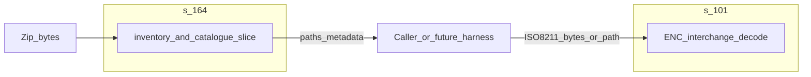

# Architecture: `s-164`

## Purpose

Provide a complete abstraction layer over published **S-164** corpus archives: download with on-disk caching, SHA-256 integrity verification, zip discovery (`**/S100_ROOT/CATALOG.XML`), minimal `S100_ExchangeCatalogue` parsing, and a typed [`Corpus`] index that yields raw dataset bytes for downstream product decoders.

The crate is structured as two layers:

- **Front door — [`Corpus`]** (in `corpus.rs`): one type per opened zip, owning the archive and precomputed [`ExchangeSetEntry`] / [`DatasetEntry`] vectors. Constructors: [`Corpus::fetch_default`] (cached + verified HTTPS download of the pinned IHO edition), [`Corpus::fetch`] (arbitrary URL + optional digest), [`Corpus::open`] (local path), [`Corpus::from_bytes`] (memory). Reads go through [`Corpus::read_dataset`].
- **Primitives** (still exported for advanced callers): `download_bytes`, `cached_download`, `discover_exchange_sets`, `parse_exchange_catalogue`, `resolve_bundle_path`, `read_zip_entry`, `sha256_hex`, `verify_sha256`, `cache_root`, `cache_path_for_url`.

## Separation of concerns

**`s-164` owns:** corpus acquisition (HTTPS download, on-disk cache, SHA-256 verification against pinned digests), zip layout discovery, minimal exchange-catalogue parsing, safe resolution of catalogue `file:/…` URIs to paths inside the archive, and classification of exchange-set prefixes ([`Classification`]) for callers that drive negative-vs-positive test scenarios.

**`s-164` does not own:** ISO 8211 semantics; S-101 (or other product) structural or feature decoding; portrayal; ECDIS runtime behaviour; full per-scenario pass/fail interpretation of the conformance manual beyond prefix-level classification; cryptographic verification of `CATALOG.SIGN` (if added later, treat as an explicitly bounded submodule or separate concern).

**Orchestration above this crate:** Any workflow that **decodes** dataset bytes — e.g. "feed ENC bytes to a product decoder → assert expectations" — belongs in `examples/`, crate `tests/` (for example **[`s-101` corpus integration tests](../s-101/tests/s164_corpus_integration.rs)**), applications, or workspace binaries. **`s-164` must not depend on [`s-101`](../s-101/) or other product crates.**

## Boundaries

- **In scope:** typed corpus index ([`Corpus`]), cached HTTPS fetch ([`cached_download`]) and bare fetch ([`download_bytes`]), zip discovery ([`discover_exchange_sets`]), UTF-8 catalogue subset ([`parse_exchange_catalogue`]), safe path join from `file:/…` URIs to zip paths ([`resolve_bundle_path`]), SHA-256 integrity verification ([`verify_sha256`]), on-disk cache management ([`cache_root`], [`cache_path_for_url`]), exchange-set prefix classification ([`Classification`]).
- **Out of scope:** TLS-certificate or `CATALOG.SIGN` verification; full GML catalogue fidelity; ENC / product decoding — see **Separation of concerns** (callers use [`s-101`](../s-101/) or the relevant product crate).

## Edition / source

[`DEFAULT_TEST_DATA_ZIP_V1_2_0_URL`] points at the **v1.2.0** prerelease asset `S-64_1.2.0.zip`; [`DEFAULT_TEST_DATA_ZIP_V1_2_0_SHA256`] pins its expected SHA-256. Bump both together when intentionally rolling editions.

## Cache layout

Default cache root: `dirs::cache_dir()/pelorus-marine/s-164/`. Override with the **`S164_CACHE_DIR`** environment variable. Files are named by the URL's final path segment. Writes are atomic (`*.partial` then rename); reads validate against the expected digest when one is supplied and silently treat a mismatch as a cache miss.

## Testing / examples

- Unit tests live next to each module (`cache.rs`, `verify.rs`, `corpus.rs`, plus the legacy hex fixture in `lib.rs` and the opportunistic `/tmp/S-64_1.2.0.zip` discovery test).
- Runnable **`examples/`**: [`inventory`](examples/inventory.rs) (`local` / `download` modes), [`parse_catalog_xml`](examples/parse_catalog_xml.rs).
