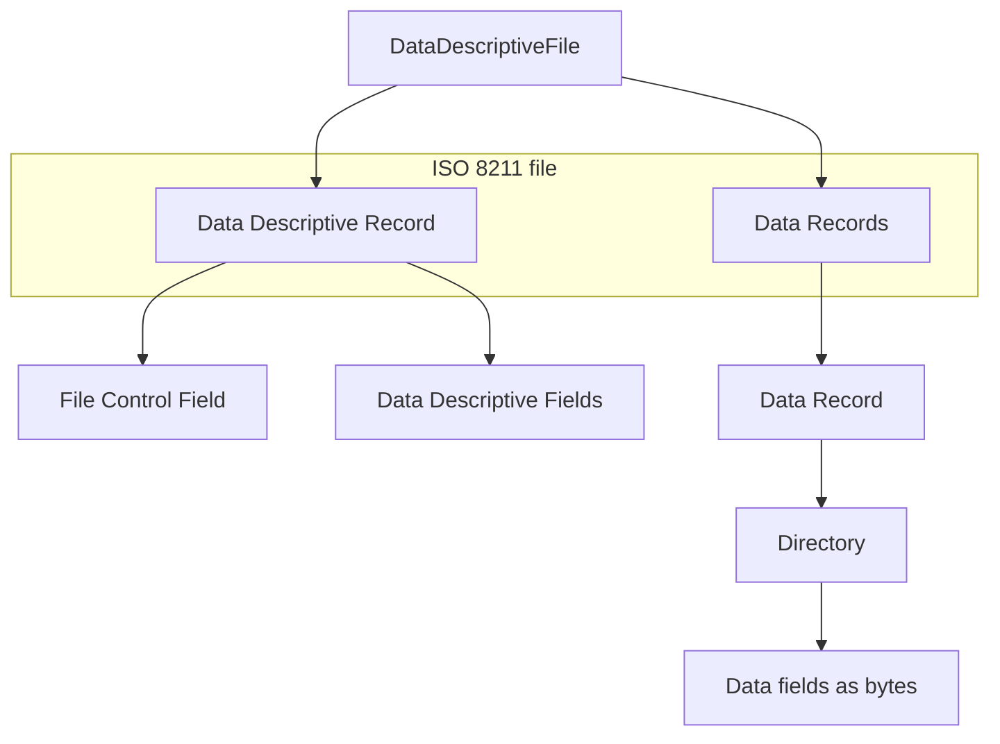

# Architecture: `iso8211`

This document summarizes how the **iso8211** crate parses a file and how modules relate to the ISO 8211 logical structure.

## Design principles

- **No `unsafe`:** The crate uses `#![forbid(unsafe_code)]`.
- **Sequential reader:** Parsing assumes a `Read + Seek` stream read mostly forward; directory order drives field reads.
- **Schema vs payload:** The Data Descriptive Record (DDR) is fully parsed into Rust types; Data Record fields are exposed as raw `Vec<u8>` / slices for higher layers to interpret.

## High-level data flow

Entry point: **`DataDescriptiveFile::read`** / **`read_buf`** (`src/data_descriptive_file.rs`).

1. **`DataDescriptiveRecord::read`** — parses DDR.
2. Loop until EOF: **`DataRecord::read`** — parses each data record.

## Module map

| Path | Role |
|------|------|
| `src/lib.rs` | Crate root, terminators `FIELD_TERMINATOR` / `UNIT_TERMINATOR`, test helpers. |
| `src/reader.rs` | `Reader<T>` — buffered numeric/text reads, field- and unit-terminated strings. |
| `src/leader.rs` | DDR vs DR leader layout (ASCII-encoded header). |
| `src/directory.rs` | List of directory entries until field terminator. |
| `src/directory_entry.rs` | Per-field tag, length, position (widths from leader entry map). |
| `src/entry_map.rs` | Leader subfield: widths of length/position/tag columns. |
| `src/error.rs` | `Iso8211Error`, `Result`. |
| `src/ddr/*` | Data Descriptive Record internals (schema). |
| `src/dr/*` | Data Record: opaque `DataField` bytes. |

### `ddr` submodule

- **`FileControlField`** — parent/child tag pairs after fixed control prefix.
- **`DataDescriptiveField`** — field controls, name, array descriptor, format controls string.
- **`Format` / `FormatControls`** — parse `(b11,A,...)` style format notation.

### `dr` submodule

- **`DataRecord`** — leader + directory + one `DataField` per directory row; **`field_tags`** align with `data_fields` by index.
- **`DataField`** — reads `field_length` bytes from the stream for that entry.

## Known limitations

- **Field positioning:** `DataField::read` assumes sequential layout using directory **length** only; if a producer uses non-sequential **position** values relative to the record base, seek logic may be required (not implemented here).
- **Character sets:** Text is decoded as UTF-8 where `String` is built; many real datasets use ASCII or encodings that remain UTF-8–compatible for metadata; binary fields use `Vec<u8>`.
- **`DirectoryEntry` in `DataDescriptiveField::read`:** Parameter is reserved; length validation against the directory row is not yet wired.

## Testing

- Unit tests live next to leaders, directories, file control field, and a large integration-style hex fixture in `data_descriptive_file.rs` resembling an S-100-style dataset.
