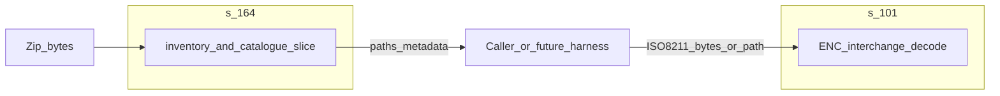

# Architecture: `s-164`

## Purpose

Download published **S-164** corpus archives (zip), discover **`S100_ROOT/CATALOG.XML`** exchange-set roots, parse a **minimal** `S100_ExchangeCatalogue` view (`ExchangeCatalogue`: identifier + dataset discovery rows).

## Separation of concerns

**`s-164` owns:** corpus acquisition (HTTPS), zip layout discovery (`**/S100_ROOT/CATALOG.XML`), minimal exchange-catalogue parsing sufficient for tooling, and safe resolution of catalogue `file:/…` URIs to paths inside the archive.

**`s-164` does not own:** ISO 8211 semantics; S-101 (or other product) structural or feature decoding; portrayal; ECDIS runtime behaviour; interpreting the conformance manual (pass/fail per scenario); cryptographic verification of `CATALOG.SIGN` (if added later, treat as an explicitly bounded submodule or separate concern).

**Orchestration:** Any workflow such as “resolve member path in zip → feed ENC bytes to a product decoder → assert expectations” belongs **above** this crate: `examples/`, crate `tests/`, applications, or **[`iho-testdata`](../iho-testdata/)** (workspace binary). **`s-164` must not depend on [`s-101`](../s-101/) or other product crates.**

## Boundaries

- **In scope:** HTTPS fetch (`download`), zip discovery (`discover_exchange_sets`), UTF-8 catalogue subset (`parse_exchange_catalogue`), safe path join from `file:/…` URIs to zip paths (`resolve_bundle_path`).
- **Out of scope:** Certificate verification; full GML catalogue fidelity; ENC / product decoding — see **Separation of concerns** (callers use [`s-101`](../s-101/) or the relevant product crate).

## Edition / source

Pin the GitHub release URL or local zip path to the **IHO edition** you test against; defaults reference **v1.2.0** prerelease assets naming (`S-64_1.2.0.zip`).

## Testing / examples

- Unit tests in `src/lib.rs` (minimal XML fixture; optional `/tmp/S-64_1.2.0.zip`; ignored network smoke test).
- Runnable **`examples/`**: [`inventory`](examples/inventory.rs) (`local` / `download` modes), [`parse_catalog_xml`](examples/parse_catalog_xml.rs).
